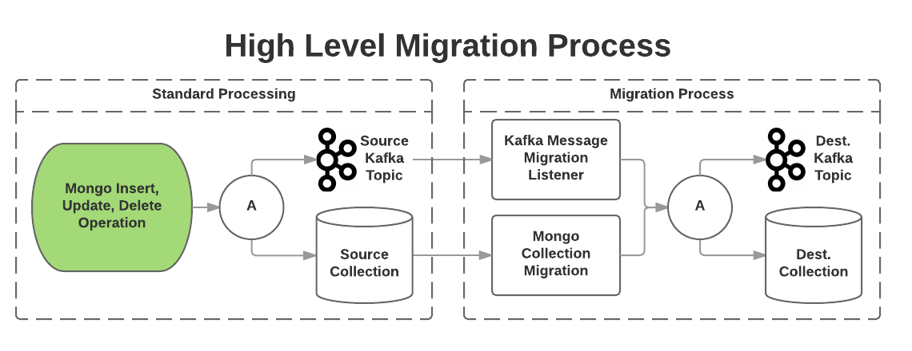
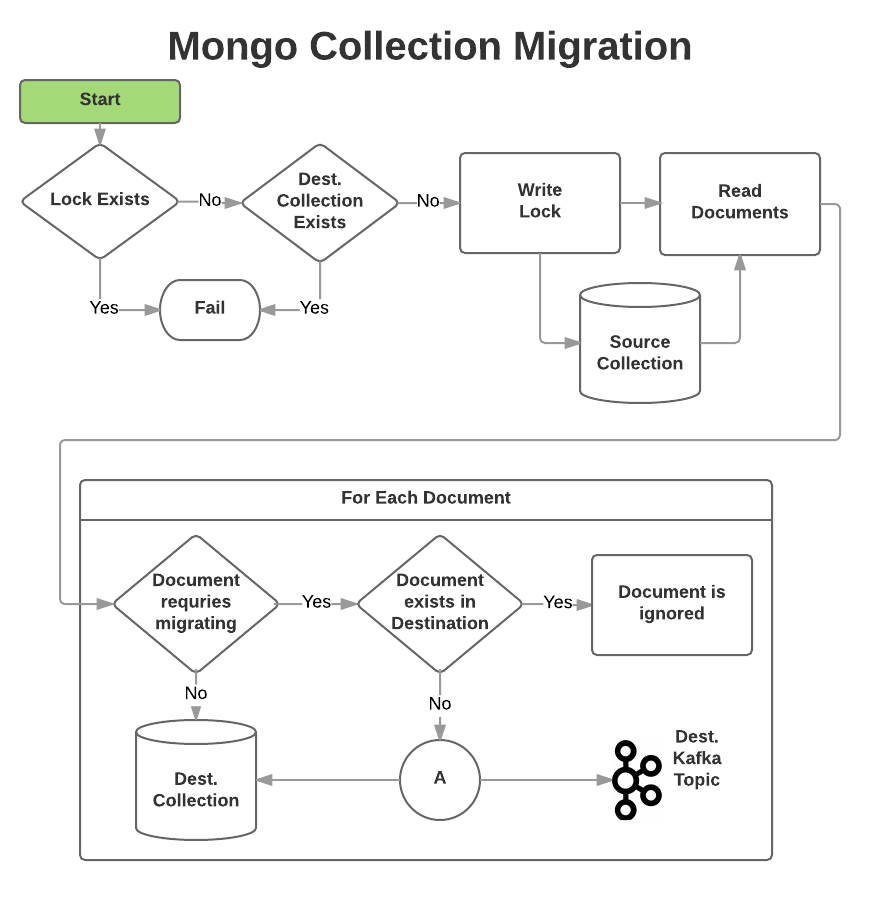

# DB Migration Spike

The purpose of this spike was to to explore different ways of running a data migration on a Mongo database with no downtime (or as little as possible).

- **[Background](#Background)**
- **[Building](#Building)**

## Background
The code in the repository can be split into 3-strands of work
- **[Mongo Migration Framework](#Mongo Migration Framework)**
- **[Personal Details Server](#Personal Details Servier)**
- **[Personal Details Client Application](#Personal Details Client Application)**

This spike demonstrates migrating a `PersonalDetails` object by removing the `name` field and introducing two new fields: `firstName` and `lastName`. For example, the object is changed from:
```json
{
  "personalDetailsId": "12345",
  "name": "Bob Builder",
  "dateOfBirth": "19700101"
}
```
To:

```json
{
  "personalDetailsId": "12345",
  "firstName": "Bob",
  "lastName": "Builder",
  "dateOfBirth": "19700101"
}
```
### Mongo Migration Framework

Two core types of Migration:
- [On-the-fly](#On-the-fly Migration)
- [Bait-and-Switch](#Bait-and-Switch Migration)

#### On-the-fly Migration
Data is written back to the original collection, the data written must be backwards compatible

#### Bait-and-Switch Migration

Data is read from the original collection, migrated and written to a new collection.  If the migration fails for any reason then the new collection can simply be dropped.



The High Level Migration Process consists of two parts:
- [Mongo Collection Migration](#Mongo Collection Migration)
- [Kafka Message Listener Migration](#Kafka Message Listener Migration)

##### Mongo Collection Migration


##### Kafka Message Listener Migration
KafkaConsumer listens to topic and consumes any CRUD operations

### Personal Details Server
A simple Spring Boot [Application](src/uk/gov/dwp/personal/details/server/PersonalDetailsServer.java) that exposes the following CRUD operations via REST over HTTP:
  - `GET /personal-details/{personalDetailsId}`
  - `POST /personal-details`
  - `PUT /personal-details`
  - `DELETE /personal-details/{personalDetailsId}`

For for more details on the operations see the [PersonalDetailsClient](src/uk/gov/dwp/personal/details/api/PersonalDetailsClient.java)

### Personal Details Client Application  
A basic client [Application](src/uk/gov/dwp/example/personal/details/client/PersonalDetailsClientApplication.java) which hits each of the HTTP endpoints of [Personal Details Server](#Personal Details Server) at the following intervals:
- Create - every 2 seconds
- Read - every 1 second
- Update - every 3 seconds
- Delete - every 5 seconds

## Building - Prerequisites
This project uses:
- [Buck](https://buckbuild.com/) as the main build tool.  Please refer to the [Getting Started Guide]() for installation and usage of Buck.
This build has been tested using `v2017.10.01.01` of Buck.
- [Docker](https://www.docker.com) to package up and run both the application and associated infrastructure.

## Building the Demo
To build the personal-details-server and personal-details-client applications execute the following commands:
```bash
./start-mongo.sh dev
buck build //...
```

This will generate two Docker images:
- `personal-details-client:${version}`
- `personal-details-server:${version}`

Where `${version}` is:
- `v1.0` - created by building on `v1.0` branch
- `latest` - created by building on `master` branch

The docker images can be seen by running the following command:
```bash
docker images
```

## Running the Demo
To execute the demo you will need the following running:
- Mongo
- Kafka
- Personal Details Server
- Personal Details Client Application

### Starting Mongo
Start a Docker container running an authenticated Mongo instance.

```bash
./start-mongo.sh demo
```
Connecting to the mongo instance from the host OS
```bash
mongo -username=admin -password=Passw0rd -authenticationDatabase=admin localhost:28018/admin
```

### Starting Kafka
```bash
./start-kafka.sh
```

### Starting HA Proxy
```bash
./start-haproxy.sh
```

### Start the Personal Details Server
Start the Personal Details Microservice running in a Docker container
```bash
./start-personal-details.sh
```
If you want to connect to the Docker container execute the following command:
```bash
docker exec -it personal-details-server-v1 /bin/bash
```

### Start the Personal Details Client Application
Start an example client which will start making HTTP requests to the `personal-details-server`
```bash
./start-personal-details-client.sh
```